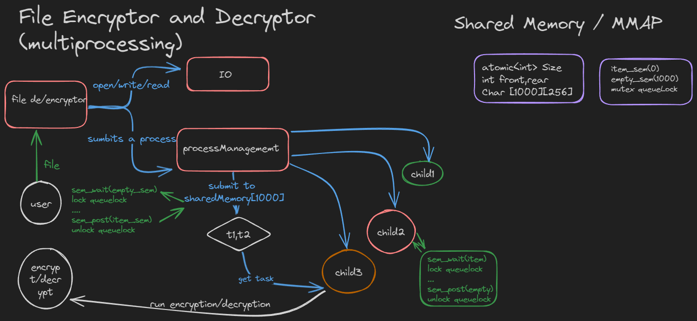

# File Encryptor / Decryptor

A file encryptor/decryptor in C++ with multiprocesing

## The core architecture of project



##### USAGE


To build and run
-> clone the repository and cd into it
-> create a .env file and write a positive numeric key in it (*required*)

```bash
cd build

cmake .. && make
# it will generate two files File_Encryptor & Cryption
# while in build directory
./File_Encryptor
```
